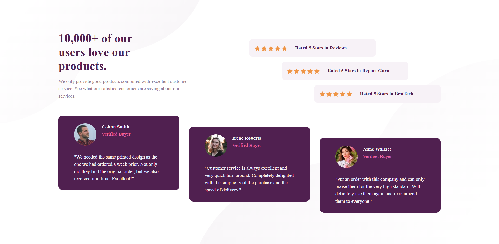
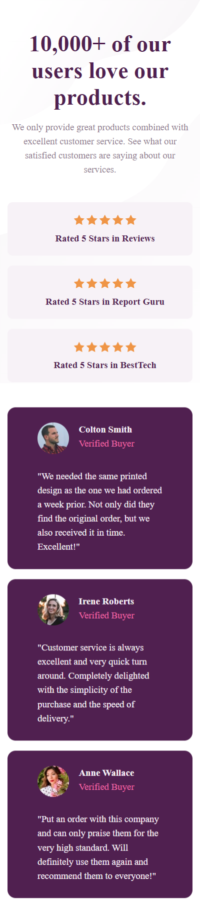

# Frontend Mentor - Social proof section solution

This is a solution to the [Social proof section challenge on Frontend Mentor](https://www.frontendmentor.io/challenges/social-proof-section-6e0qTv_bA). Frontend Mentor challenges help you improve your coding skills by building realistic projects.

## Table of contents

- [Overview](#overview)
  - [The challenge](#the-challenge)
  - [Screenshot](#screenshot) -
- [My process](#my-process)
  - [Built with](#built-with)
  - [Useful resources](#useful-resources)
- [Author](#author)

## Overview

### The challenge

Users should be able to:

- View the optimal layout for the section depending on their device's screen size

### Screenshot

### Links

- Live Site URL:[Responsive-social-proof-section-master](https://somaye-beiranvand.github.io/FrontendMentor-Responsive-social-proof-section-master/)

## My process

### Built with

- HTML5
- CSS custom properties
- Flexbox
- CSS Grid
- Mobile-first workflow
- bootstrap

### Useful resources

- [bootsrtap customizations](https://www.youtube.com/watch?v=nCX3QVl_PiI) - This helped me customize bootstrap containers max-width

## Author

- Frontend Mentor - [@somaye-beiranvand](https://www.frontendmentor.io/profile/yourusername)
